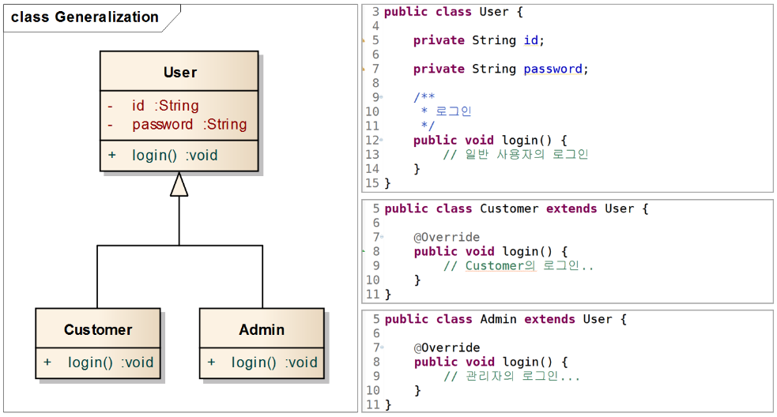
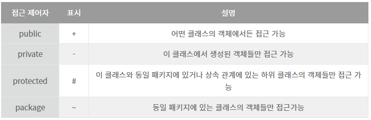

1. 클래스 관계

- 일반화: 상속.
- 실체화: interface에 있는 spec을 오버라이딩하여 실제로 구현하는 것.
- 의존관계
  - **메서드** 내에서 대상 클래스의 객체를 생성하거나 리턴받아 사용하는 것.
  - 전체객체가 부분객체를 매개변수로 받음. 전체객체와 부분객체의 생명주기가 동일하지 않음. 
- 연관관계
  - 다른 객체의 참조를 가지는 **필드**를 사용하는 것.  
- 직접연관
  - 연관관계인데 방향성을 갖는 경우.
- 집합(집약)연관
  - 전체객체와 부분객체의 `라이프 타임`이 **독립적**.
  - 연관의 집합관계를 나타내는 것으로 Collection이나 Array를 이용하는 관계, 하지만 이 관계는 일반적인 연관으로도 충분히 나타낼 수 있는 관계, 바로 1 : N 연관관계.
  - 전체객체가 생성될 때 생성자의 인자로 받음. 부분객체를 전체객체와 다른 객체가 공유.
- 합성연관
  - 전체를 나타내는 객체에 부분을 나타내는 객체의 `라이프 타임`이 **종속적**.
  - 전체객체가 생성될 때 생성자에서 새로(new)로 생성. 부분객체를 전체객체만 사용.

2. 일반화

3. 실체화

4. 의존

참조의 형태는 메서드 내에서 대상 클래스의 객체 생성, 객체 사용, 메서드 호출, 객체 리턴, 매개변수로 해당 객체를 받는 것 등을 말하며 해당 객체의 **참조를 계속 유지하지는 않는다.**

5. 접근제어자

